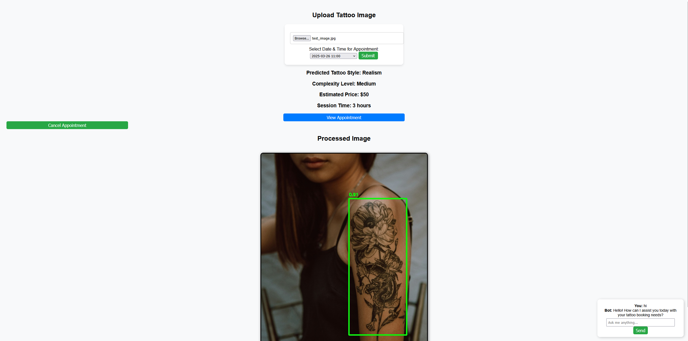

# Tattoo Booking System (AI-Powered) 🎨🤖

An end-to-end tattoo booking and scheduling system powered by AI. This project integrates image recognition using YOLOv8, tattoo style classification with PyTorch, session duration & pricing estimation, and Google Calendar syncing — all wrapped in a FastAPI web backend.

---

## 🚀 Features

- **Tattoo Complexity Detection** (YOLOv8)
- **Tattoo Style Classification** (PyTorch-based CNN)
- **Session Duration & Pricing Estimator**
- **AI Chatbot** for User Queries
- **Admin & Customer Dashboards** (HTML + JS)
- **Google Calendar Integration**
- **Modular FastAPI Backend**
- Model training notebooks and scripts included

---

## 🗂️ Project Structure

```bash
tattoo-booking-system/
│
├── app/
│   ├── api/              # FastAPI route handlers
│   ├── core/             # Config, auth, static/templates loading
│   ├── models/           # Model wrappers (YOLO & classifier)
│   ├── routes/           # Frontend page routes
│   ├── services/         # Business logic: pricing, calendar, preprocessing
│   ├── static/           # JS, CSS, favicon
│   ├── templates/        # HTML templates
│   └── utils/            # Utility functions
│
├── data/                 # Sample/test data (JSON, CSV)
├── models/               # Pretrained model files (ignored in Git)
├── notebooks/            # Model training scripts
├── scripts/              # Utility & testing scripts
├── tests/                # Unit tests
├── main.py               # App entrypoint
├── .env.example          # Environment variable template
├── requirements.txt      # Python dependencies
└── README.md             # You're here :)
```

---

## 🧪 Setup Instructions

### 1. Clone the repository

```bash
git clone https://github.com/VibhavJaiswal/tattoo-booking-system.git
cd tattoo-booking-system
```

### 2. Setup virtual environment

```bash
python -m venv venv
venv\\Scripts\\activate     # On Windows
source venv/bin/activate  # On Linux/Mac
```

### 3. Install dependencies

```bash
pip install -r requirements.txt
```

### 4. Add `.env` file

Create a `.env` file (you can start with `.env.example`) and add your API keys, model paths, and calendar credentials.

---

## 🤖 Model Files

Large model files are **not included** in the repo.

Please download the following and place them in the correct folders:
- `best.pt` (YOLOv8 weights)
- `tattoo_classifier.pth` (PyTorch classifier model)

👉 Store them in `/models/` and update the `.env` paths.

---

## 🧠 How it works

- Upload an image
- YOLO detects tattoo complexity
- PyTorch classifies the style
- Pricing + session time estimated
- User can book appointment → auto-added to Google Calendar

---

## 📸 Screenshots

### 🔧 Admin Dashboard
This page shows the administrator's view with booking management, complexity insights, and session estimations.


---

### 🧑‍🎨 User Booking Page
This interface allows users to upload tattoo references, get AI-based estimates, and book appointments.



---

## 📄 License

This project is currently not licensed for public or commercial use.

It is intended for educational and portfolio demonstration purposes only.

You may explore the code, but please do not reproduce, distribute, or use it in production without the author's permission.

---

## 🙌 Author

**Vibhav Jaiswal**  
📧 mail.vibhav@gmail.com  
🌐 [GitHub Profile](https://github.com/VibhavJaiswal)

---

> Built for real-world learning and portfolio showcase. Feel free to fork or contribute!
